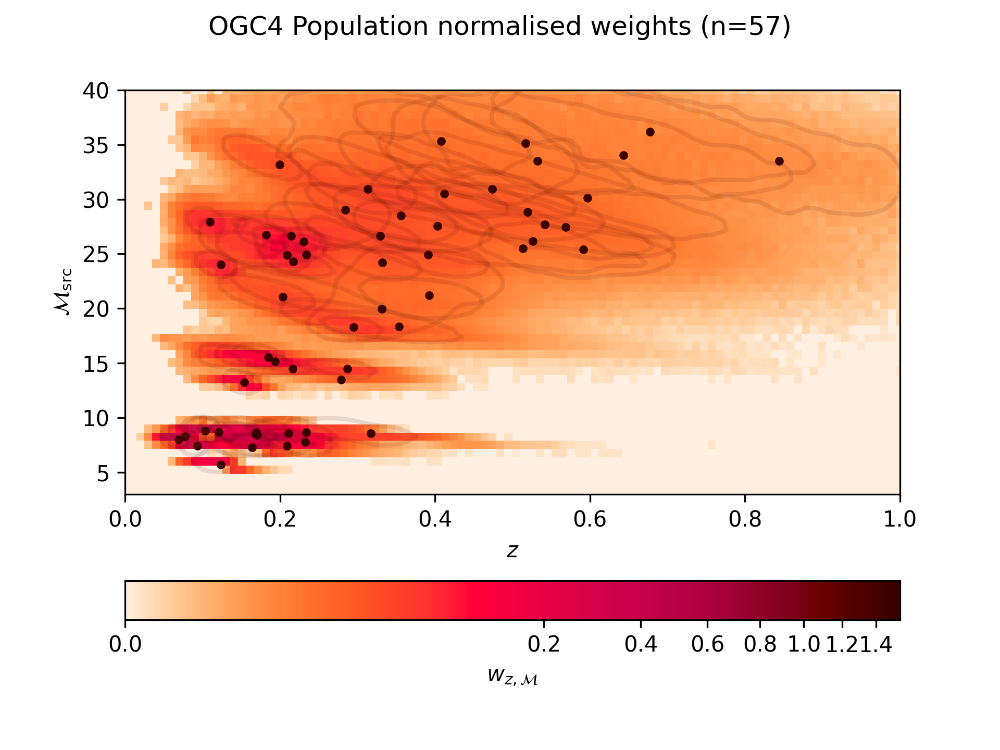
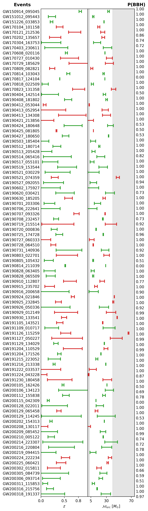

# OGC-4 Interface
This repo interfaces with OGC-4 (https://github.com/gwastro/4-ogc) to help get us the LVK data we need.

The main class needed will be the `PopulationMcZ` class, which will be used to get the Mc-z posterior samples and
priors for all the events, and cache them as a matrix of binned Mc-z weights.


```python
from ogc4_interface.population_mcz import PopulationMcZ
import numpy as np


mc_bins = np.linspace(3, 40, 100)
z_bins = np.linspace(0, 1, 100)
population = PopulationMcZ.load()
population.plot_weights()

```

## Weights



## Events used

